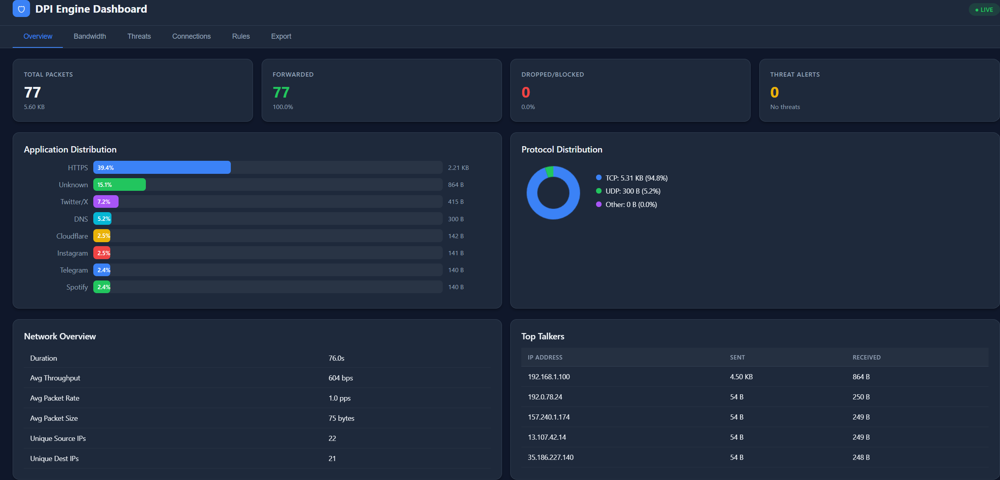

<div align="center">

```
██████╗ ██████╗ ██╗    ███████╗███╗   ██╗ ██████╗ ██╗███╗   ██╗███████╗
██╔══██╗██╔══██╗██║    ██╔════╝████╗  ██║██╔════╝ ██║████╗  ██║██╔════╝
██║  ██║██████╔╝██║    █████╗  ██╔██╗ ██║██║  ███╗██║██╔██╗ ██║█████╗  
██║  ██║██╔═══╝ ██║    ██╔══╝  ██║╚██╗██║██║   ██║██║██║╚██╗██║██╔══╝  
██████╔╝██║     ██║    ███████╗██║ ╚████║╚██████╔╝██║██║ ╚████║███████╗
╚═════╝ ╚═╝     ╚═╝    ╚══════╝╚═╝  ╚═══╝ ╚═════╝ ╚═╝╚═╝  ╚═══╝╚══════╝
```

### Deep Packet Inspection System


**Inspect. Classify. Block. Visualize.**

A high-performance, multi-threaded deep packet inspection engine with a built-in web dashboard, real-time threat detection, bandwidth monitoring, and REST API — all in pure C++17 with **zero external dependencies**.



[**🔴 Live Demo**](https://dpi-dashboard.onrender.com) · [Get Started](#-quick-start) · [Features](#-feature-highlights) · [Dashboard](#-web-dashboard) · [Architecture](#-architecture) · [API Reference](#-rest-api)

</div>

---

## ✨ Feature Highlights

<table>
<tr>
<td width="50%">

### 🔍 Deep Packet Inspection
- TLS SNI extraction from HTTPS
- HTTP Host header parsing
- DNS query extraction
- 20+ application signatures
- Port-based fallback classification

</td>
<td width="50%">

### 🛡️ Threat Detection
- Port scan detection
- DDoS / flood detection
- SYN flood analysis
- DNS tunneling / exfiltration alerts
- Severity levels: LOW → CRITICAL

</td>
</tr>
<tr>
<td width="50%">

### 📊 Bandwidth Monitoring
- Per-application data usage
- Top talkers (heaviest IPs)
- TCP vs UDP breakdown
- Time-series traffic data
- Average throughput & packet rate

</td>
<td width="50%">

### 🌐 Web Dashboard
- Real-time stats & charts
- Interactive rule management
- Connection table viewer
- Threat alert feed
- JSON / CSV export

</td>
</tr>
</table>

---

## 🚀 Quick Start

```bash
# 1. Build
g++ -std=c++17 -I include -o dpi_dashboard.exe \
    src/main_dashboard.cpp src/threat_detector.cpp \
    src/bandwidth_monitor.cpp src/report_exporter.cpp \
    src/web_server.cpp src/pcap_reader.cpp \
    src/packet_parser.cpp src/sni_extractor.cpp \
    src/types.cpp -lws2_32

# 2. Run (dashboard opens at http://localhost:8080)
./dpi_dashboard capture.pcap filtered.pcap

# 3. Open your browser to http://localhost:8080
# Or try the live demo: https://dpi-dashboard.onrender.com
```

> 💡 **Tip:** Use `--no-dashboard` for CLI-only mode, or `--port 9090` for a custom port.

---

## 🎯 What is DPI?

**Deep Packet Inspection (DPI)** examines the contents of network packets as they pass through a checkpoint. Unlike simple firewalls that only look at headers, DPI looks *inside* the payload.

```
                    ┌──────────────────────────────────┐
                    │         🔍 DPI ENGINE             │
                    │                                   │
 📥 Input PCAP ──► │  Parse → Classify → Block/Allow  │ ──► 📤 Filtered PCAP
                    │                                   │
                    │  + Threat Detection               │
                    │  + Bandwidth Monitoring            │
                    │  + Web Dashboard                   │
                    └──────────────────────────────────┘
```

<details>
<summary><b>🏢 Real-World Uses (click to expand)</b></summary>

| Use Case | Description |
|:---:|---|
| 🌐 **ISPs** | Throttle or block applications (e.g., BitTorrent) |
| 🏗️ **Enterprises** | Block social media on office networks |
| 👨‍👩‍👧 **Parental Controls** | Block inappropriate websites |
| 🔒 **Security** | Detect malware, intrusions, and data exfiltration |

</details>

---

## 🧠 Networking Background

<details>
<summary><b>📶 The Network Stack (click to expand)</b></summary>

When you visit a website, data travels through multiple "layers":

```
  ┌──────────────────────────────────────────────────────────────┐
  │  Layer 7: Application   │  HTTP, TLS, DNS                   │  ◄── DPI inspects here
  ├──────────────────────────────────────────────────────────────┤
  │  Layer 4: Transport     │  TCP (reliable), UDP (fast)       │  ◄── Ports, flags
  ├──────────────────────────────────────────────────────────────┤
  │  Layer 3: Network       │  IP addresses (routing)           │  ◄── Source/Dest IP
  ├──────────────────────────────────────────────────────────────┤
  │  Layer 2: Data Link     │  MAC addresses (local network)    │  ◄── Ethernet
  └──────────────────────────────────────────────────────────────┘
```

</details>

<details>
<summary><b>📦 Packet Structure — Russian Nesting Doll (click to expand)</b></summary>

Every network packet is headers wrapped inside headers:

```
  ╔══════════════════════════════════════════════════════════════════╗
  ║  Ethernet Header (14 bytes)                                     ║
  ║  ┌──────────────────────────────────────────────────────────┐   ║
  ║  │  IP Header (20 bytes)                                    │   ║
  ║  │  ┌──────────────────────────────────────────────────┐    │   ║
  ║  │  │  TCP Header (20 bytes)                           │    │   ║
  ║  │  │  ┌──────────────────────────────────────────┐    │    │   ║
  ║  │  │  │  🔍 Payload (Application Data)           │    │    │   ║
  ║  │  │  │  e.g., TLS Client Hello with SNI         │    │    │   ║
  ║  │  │  └──────────────────────────────────────────┘    │    │   ║
  ║  │  └──────────────────────────────────────────────────┘    │   ║
  ║  └──────────────────────────────────────────────────────────┘   ║
  ╚══════════════════════════════════════════════════════════════════╝
```

</details>

### 🔗 The Five-Tuple

A **connection** (or "flow") is uniquely identified by 5 values:

| | Field | Example | Purpose |
|:---:|:---|:---|:---|
| 📤 | Source IP | `192.168.1.100` | Who is sending |
| 📥 | Destination IP | `172.217.14.206` | Where it's going |
| 🔢 | Source Port | `54321` | Sender's app identifier |
| 🎯 | Destination Port | `443` | Service (443 = HTTPS) |
| 📡 | Protocol | `TCP (6)` | TCP or UDP |

> All packets with the same 5-tuple belong to the **same connection**. This is how we track conversations between computers.

### 🔐 What is SNI?

**Server Name Indication (SNI)** is the *key* to DPI. Even though HTTPS is encrypted, the domain name is visible in the **first packet**!

```
  🖥️ Browser                                          🌐 Server
     │                                                   │
     │──── TLS Client Hello ────────────────────────────►│
     │     ┌─────────────────────────────────────┐       │
     │     │  Version: TLS 1.2                   │       │
     │     │  Random: [32 bytes]                 │       │
     │     │  Cipher Suites: [list]              │       │
     │     │  Extensions:                        │       │
     │     │    └─ SNI: "www.youtube.com" 🎯     │       │
     │     └─────────────────────────────────────┘       │
     │                                                   │
     │◄═══ 🔒 Encrypted from here on ═══════════════════│
```

---

## 🏗️ Architecture

### Three Versions

| | Version | File | Best For |
|:---:|:---|:---|:---|
| 📝 | Simple (Single-threaded) | `main_working.cpp` | Learning, small captures |
| ⚡ | Multi-threaded | `dpi_mt.cpp` | Performance, large captures |
| 🌐 | **Dashboard (v3.0)** | **`main_dashboard.cpp`** | **Full-featured with Web UI** |

### 📁 Project Structure

```
packet_analyzer/
│
├── 📂 include/                         ── Header Files ──
│   ├── pcap_reader.h                   PCAP file reading
│   ├── packet_parser.h                 Network protocol parsing
│   ├── sni_extractor.h                 TLS / HTTP / DNS inspection
│   ├── types.h                         Core data structures
│   ├── rule_manager.h                  Blocking rules engine
│   ├── connection_tracker.h            Flow tracking
│   ├── load_balancer.h                 Load balancer thread
│   ├── fast_path.h                     Fast path processor thread
│   ├── thread_safe_queue.h             Lock-free queue
│   ├── dpi_engine.h                    Multi-threaded orchestrator
│   ├── 🆕 threat_detector.h            Anomaly & threat detection
│   ├── 🆕 bandwidth_monitor.h          Per-app bandwidth tracking
│   ├── 🆕 report_exporter.h            JSON / CSV export
│   └── 🆕 web_server.h                 Embedded HTTP server
│
├── 📂 src/                             ── Source Files ──
│   ├── pcap_reader.cpp                 PCAP file handling
│   ├── packet_parser.cpp               Protocol parsing
│   ├── sni_extractor.cpp               SNI / Host extraction
│   ├── types.cpp                       Helper functions
│   ├── main_working.cpp                ★ Simple version
│   ├── dpi_mt.cpp                      ★ Multi-threaded version
│   ├── 🆕 main_dashboard.cpp           ★ v3.0 Dashboard version
│   ├── 🆕 threat_detector.cpp          Threat detection logic
│   ├── 🆕 bandwidth_monitor.cpp        Bandwidth tracking logic
│   ├── 🆕 report_exporter.cpp          JSON / CSV serialization
│   └── 🆕 web_server.cpp               HTTP server + embedded HTML
│
├── generate_test_pcap.py               Creates test data
├── test_dpi.pcap                       Sample capture file
├── CMakeLists.txt                      Build configuration
└── README.md                           You are here!
```

---

## 🔄 The Journey of a Packet (Simple Version)

> 🗺️ Let's trace a single packet through `main_working.cpp`

### Step 1: Read PCAP File

```cpp
PcapReader reader;
reader.open("capture.pcap");
```

**What happens:**
1. Open the file in binary mode
2. Read the 24-byte global header (magic number, version, etc.)
3. Verify it's a valid PCAP file

**PCAP File Format:**
```
┌────────────────────────────┐
│ Global Header (24 bytes)   │  ← Read once at start
├────────────────────────────┤
│ Packet Header (16 bytes)   │  ← Timestamp, length
│ Packet Data (variable)     │  ← Actual network bytes
├────────────────────────────┤
│ Packet Header (16 bytes)   │
│ Packet Data (variable)     │
├────────────────────────────┤
│ ... more packets ...       │
└────────────────────────────┘
```

### Step 2: Read Each Packet

```cpp
while (reader.readNextPacket(raw)) {
    // raw.data contains the packet bytes
    // raw.header contains timestamp and length
}
```

**What happens:**
1. Read 16-byte packet header
2. Read N bytes of packet data (N = header.incl_len)
3. Return false when no more packets

### Step 3: Parse Protocol Headers

```cpp
PacketParser::parse(raw, parsed);
```

**What happens (in packet_parser.cpp):**

```
raw.data bytes:
[0-13]   Ethernet Header
[14-33]  IP Header  
[34-53]  TCP Header
[54+]    Payload

After parsing:
parsed.src_mac  = "00:11:22:33:44:55"
parsed.dest_mac = "aa:bb:cc:dd:ee:ff"
parsed.src_ip   = "192.168.1.100"
parsed.dest_ip  = "172.217.14.206"
parsed.src_port = 54321
parsed.dest_port = 443
parsed.protocol = 6 (TCP)
parsed.has_tcp  = true
```

**Parsing the Ethernet Header (14 bytes):**
```
Bytes 0-5:   Destination MAC
Bytes 6-11:  Source MAC
Bytes 12-13: EtherType (0x0800 = IPv4)
```

**Parsing the IP Header (20+ bytes):**
```
Byte 0:      Version (4 bits) + Header Length (4 bits)
Byte 8:      TTL (Time To Live)
Byte 9:      Protocol (6=TCP, 17=UDP)
Bytes 12-15: Source IP
Bytes 16-19: Destination IP
```

**Parsing the TCP Header (20+ bytes):**
```
Bytes 0-1:   Source Port
Bytes 2-3:   Destination Port
Bytes 4-7:   Sequence Number
Bytes 8-11:  Acknowledgment Number
Byte 12:     Data Offset (header length)
Byte 13:     Flags (SYN, ACK, FIN, etc.)
```

### Step 4: Create Five-Tuple and Look Up Flow

```cpp
FiveTuple tuple;
tuple.src_ip = parseIP(parsed.src_ip);
tuple.dst_ip = parseIP(parsed.dest_ip);
tuple.src_port = parsed.src_port;
tuple.dst_port = parsed.dest_port;
tuple.protocol = parsed.protocol;

Flow& flow = flows[tuple];  // Get or create
```

**What happens:**
- The flow table is a hash map: `FiveTuple → Flow`
- If this 5-tuple exists, we get the existing flow
- If not, a new flow is created
- All packets with the same 5-tuple share the same flow

### Step 5: Extract SNI (Deep Packet Inspection)

```cpp
// For HTTPS traffic (port 443)
if (pkt.tuple.dst_port == 443 && pkt.payload_length > 5) {
    auto sni = SNIExtractor::extract(payload, payload_length);
    if (sni) {
        flow.sni = *sni;                    // "www.youtube.com"
        flow.app_type = sniToAppType(*sni); // AppType::YOUTUBE
    }
}
```

**What happens (in sni_extractor.cpp):**

1. **Check if it's a TLS Client Hello:**
   ```
   Byte 0: Content Type = 0x16 (Handshake) ✓
   Byte 5: Handshake Type = 0x01 (Client Hello) ✓
   ```

2. **Navigate to Extensions:**
   ```
   Skip: Version, Random, Session ID, Cipher Suites, Compression
   ```

3. **Find SNI Extension (type 0x0000):**
   ```
   Extension Type: 0x0000 (SNI)
   Extension Length: N
   SNI List Length: M
   SNI Type: 0x00 (hostname)
   SNI Length: L
   SNI Value: "www.youtube.com"  ← FOUND!
   ```

4. **Map SNI to App Type:**
   ```cpp
   // In types.cpp
   if (sni.find("youtube") != std::string::npos) {
       return AppType::YOUTUBE;
   }
   ```

### Step 6: Check Blocking Rules

```cpp
if (rules.isBlocked(tuple.src_ip, flow.app_type, flow.sni)) {
    flow.blocked = true;
}
```

**What happens:**
```cpp
// Check IP blacklist
if (blocked_ips.count(src_ip)) return true;

// Check app blacklist
if (blocked_apps.count(app)) return true;

// Check domain blacklist (substring match)
for (const auto& dom : blocked_domains) {
    if (sni.find(dom) != std::string::npos) return true;
}

return false;
```

### Step 7: Forward or Drop

```cpp
if (flow.blocked) {
    dropped++;
    // Don't write to output
} else {
    forwarded++;
    // Write packet to output file
    output.write(packet_header);
    output.write(packet_data);
}
```

### Step 8: Generate Report

After processing all packets:
```cpp
// Count apps
for (const auto& [tuple, flow] : flows) {
    app_stats[flow.app_type]++;
}

// Print report
"YouTube: 150 packets (15%)"
"Facebook: 80 packets (8%)"
...
```

---

## ⚡ The Journey of a Packet (Multi-threaded Version)

The multi-threaded version (`dpi_mt.cpp`) adds **parallelism** for high performance.

### Architecture Overview

```
                         ┌─────────────────────┐
                         │  📖 Reader Thread    │
                         │  (reads PCAP file)   │
                         └──────────┬───────────┘
                                    │
                    ┌───────────────┴───────────────┐
                    │      hash(5-tuple) % 2        │
                    ▼                               ▼
          ┌──────────────────┐            ┌──────────────────┐
          │  ⚖️ LB0 Thread    │            │  ⚖️ LB1 Thread    │
          │  (Load Balancer) │            │  (Load Balancer) │
          └────────┬─────────┘            └────────┬─────────┘
                   │                               │
            ┌──────┴──────┐                 ┌──────┴──────┐
            ▼             ▼                 ▼             ▼
      ┌──────────┐ ┌──────────┐      ┌──────────┐ ┌──────────┐
      │🔍 FP0    │ │🔍 FP1    │      │🔍 FP2    │ │🔍 FP3    │
      │Fast Path │ │Fast Path │      │Fast Path │ │Fast Path │
      └────┬─────┘ └────┬─────┘      └────┬─────┘ └────┬─────┘
           │             │                 │             │
           └─────────────┴─────────────────┴─────────────┘
                                 │
                                 ▼
                   ┌──────────────────────────┐
                   │  📤 Output Writer Thread  │
                   │  (writes filtered PCAP)   │
                   └──────────────────────────┘
```

### Why This Design?

1. **Load Balancers (LBs):** Distribute work across FPs
2. **Fast Paths (FPs):** Do the actual DPI processing
3. **Consistent Hashing:** Same 5-tuple always goes to same FP

**Why consistent hashing matters:**
```
Connection: 192.168.1.100:54321 → 142.250.185.206:443

Packet 1 (SYN):         hash → FP2
Packet 2 (SYN-ACK):     hash → FP2  (same FP!)
Packet 3 (Client Hello): hash → FP2  (same FP!)
Packet 4 (Data):        hash → FP2  (same FP!)

All packets of this connection go to FP2.
FP2 can track the flow state correctly.
```

### Detailed Flow

#### Step 1: Reader Thread

```cpp
// Main thread reads PCAP
while (reader.readNextPacket(raw)) {
    Packet pkt = createPacket(raw);
    
    // Hash to select Load Balancer
    size_t lb_idx = hash(pkt.tuple) % num_lbs;
    
    // Push to LB's queue
    lbs_[lb_idx]->queue().push(pkt);
}
```

#### Step 2: Load Balancer Thread

```cpp
void LoadBalancer::run() {
    while (running_) {
        // Pop from my input queue
        auto pkt = input_queue_.pop();
        
        // Hash to select Fast Path
        size_t fp_idx = hash(pkt.tuple) % num_fps_;
        
        // Push to FP's queue
        fps_[fp_idx]->queue().push(pkt);
    }
}
```

#### Step 3: Fast Path Thread

```cpp
void FastPath::run() {
    while (running_) {
        // Pop from my input queue
        auto pkt = input_queue_.pop();
        
        // Look up flow (each FP has its own flow table)
        Flow& flow = flows_[pkt.tuple];
        
        // Classify (SNI extraction)
        classifyFlow(pkt, flow);
        
        // Check rules
        if (rules_->isBlocked(pkt.tuple.src_ip, flow.app_type, flow.sni)) {
            stats_->dropped++;
        } else {
            // Forward: push to output queue
            output_queue_->push(pkt);
        }
    }
}
```

#### Step 4: Output Writer Thread

```cpp
void outputThread() {
    while (running_ || output_queue_.size() > 0) {
        auto pkt = output_queue_.pop();
        
        // Write to output file
        output_file.write(packet_header);
        output_file.write(pkt.data);
    }
}
```

### Thread-Safe Queue

The magic that makes multi-threading work:

```cpp
template<typename T>
class TSQueue {
    std::queue<T> queue_;
    std::mutex mutex_;
    std::condition_variable not_empty_;
    std::condition_variable not_full_;
    
    void push(T item) {
        std::lock_guard<std::mutex> lock(mutex_);
        queue_.push(item);
        not_empty_.notify_one();  // Wake up waiting consumer
    }
    
    T pop() {
        std::unique_lock<std::mutex> lock(mutex_);
        not_empty_.wait(lock, [&]{ return !queue_.empty(); });
        T item = queue_.front();
        queue_.pop();
        return item;
    }
};
```

**How it works:**
- `push()`: Producer adds item, signals waiting consumers
- `pop()`: Consumer waits until item available, then takes it
- `mutex`: Only one thread can access at a time
- `condition_variable`: Efficient waiting (no busy-loop)

---

## 🔬 Deep Dive: Each Component

### pcap_reader.h / pcap_reader.cpp

**Purpose:** Read network captures saved by Wireshark

**Key structures:**
```cpp
struct PcapGlobalHeader {
    uint32_t magic_number;   // 0xa1b2c3d4 identifies PCAP
    uint16_t version_major;  // Usually 2
    uint16_t version_minor;  // Usually 4
    uint32_t snaplen;        // Max packet size captured
    uint32_t network;        // 1 = Ethernet
};

struct PcapPacketHeader {
    uint32_t ts_sec;         // Timestamp (seconds)
    uint32_t ts_usec;        // Timestamp (microseconds)
    uint32_t incl_len;       // Bytes saved in file
    uint32_t orig_len;       // Original packet size
};
```

**Key functions:**
- `open(filename)`: Open PCAP, validate header
- `readNextPacket(raw)`: Read next packet into buffer
- `close()`: Clean up

### packet_parser.h / packet_parser.cpp

**Purpose:** Extract protocol fields from raw bytes

**Key function:**
```cpp
bool PacketParser::parse(const RawPacket& raw, ParsedPacket& parsed) {
    parseEthernet(...);  // Extract MACs, EtherType
    parseIPv4(...);      // Extract IPs, protocol, TTL
    parseTCP(...);       // Extract ports, flags, seq numbers
    // OR
    parseUDP(...);       // Extract ports
}
```

**Important concepts:**

*Network Byte Order:* Network protocols use big-endian (most significant byte first). Your computer might use little-endian. We use `ntohs()` and `ntohl()` to convert:
```cpp
// ntohs = Network TO Host Short (16-bit)
uint16_t port = ntohs(*(uint16_t*)(data + offset));

// ntohl = Network TO Host Long (32-bit)
uint32_t seq = ntohl(*(uint32_t*)(data + offset));
```

### sni_extractor.h / sni_extractor.cpp

**Purpose:** Extract domain names from TLS and HTTP

**For TLS (HTTPS):**
```cpp
std::optional<std::string> SNIExtractor::extract(
    const uint8_t* payload, 
    size_t length
) {
    // 1. Verify TLS record header
    // 2. Verify Client Hello handshake
    // 3. Skip to extensions
    // 4. Find SNI extension (type 0x0000)
    // 5. Extract hostname string
}
```

**For HTTP:**
```cpp
std::optional<std::string> HTTPHostExtractor::extract(
    const uint8_t* payload,
    size_t length
) {
    // 1. Verify HTTP request (GET, POST, etc.)
    // 2. Search for "Host: " header
    // 3. Extract value until newline
}
```

### types.h / types.cpp

**Purpose:** Define data structures used throughout

**FiveTuple:**
```cpp
struct FiveTuple {
    uint32_t src_ip;
    uint32_t dst_ip;
    uint16_t src_port;
    uint16_t dst_port;
    uint8_t  protocol;
    
    bool operator==(const FiveTuple& other) const;
};
```

**AppType:**
```cpp
enum class AppType {
    UNKNOWN,
    HTTP,
    HTTPS,
    DNS,
    GOOGLE,
    YOUTUBE,
    FACEBOOK,
    // ... more apps
};
```

**sniToAppType function:**
```cpp
AppType sniToAppType(const std::string& sni) {
    if (sni.find("youtube") != std::string::npos) 
        return AppType::YOUTUBE;
    if (sni.find("facebook") != std::string::npos) 
        return AppType::FACEBOOK;
    // ... more patterns
}
```

---

## 🔐 How SNI Extraction Works

### The TLS Handshake

When you visit `https://www.youtube.com`:

```
┌──────────┐                              ┌──────────┐
│  Browser │                              │  Server  │
└────┬─────┘                              └────┬─────┘
     │                                         │
     │ ──── Client Hello ─────────────────────►│
     │      (includes SNI: www.youtube.com)    │
     │                                         │
     │ ◄─── Server Hello ───────────────────── │
     │      (includes certificate)             │
     │                                         │
     │ ──── Key Exchange ─────────────────────►│
     │                                         │
     │ ◄═══ Encrypted Data ══════════════════► │
     │      (from here on, everything is       │
     │       encrypted - we can't see it)      │
```

**We can only extract SNI from the Client Hello!**

### TLS Client Hello Structure

```
Byte 0:     Content Type = 0x16 (Handshake)
Bytes 1-2:  Version = 0x0301 (TLS 1.0)
Bytes 3-4:  Record Length

-- Handshake Layer --
Byte 5:     Handshake Type = 0x01 (Client Hello)
Bytes 6-8:  Handshake Length

-- Client Hello Body --
Bytes 9-10:  Client Version
Bytes 11-42: Random (32 bytes)
Byte 43:     Session ID Length (N)
Bytes 44 to 44+N: Session ID
... Cipher Suites ...
... Compression Methods ...

-- Extensions --
Bytes X-X+1: Extensions Length
For each extension:
    Bytes: Extension Type (2)
    Bytes: Extension Length (2)
    Bytes: Extension Data

-- SNI Extension (Type 0x0000) --
Extension Type: 0x0000
Extension Length: L
  SNI List Length: M
  SNI Type: 0x00 (hostname)
  SNI Length: K
  SNI Value: "www.youtube.com" ← THE GOAL!
```

### Our Extraction Code (Simplified)

```cpp
std::optional<std::string> SNIExtractor::extract(
    const uint8_t* payload, size_t length
) {
    // Check TLS record header
    if (payload[0] != 0x16) return std::nullopt;  // Not handshake
    if (payload[5] != 0x01) return std::nullopt;  // Not Client Hello
    
    size_t offset = 43;  // Skip to session ID
    
    // Skip Session ID
    uint8_t session_len = payload[offset];
    offset += 1 + session_len;
    
    // Skip Cipher Suites
    uint16_t cipher_len = readUint16BE(payload + offset);
    offset += 2 + cipher_len;
    
    // Skip Compression Methods
    uint8_t comp_len = payload[offset];
    offset += 1 + comp_len;
    
    // Read Extensions Length
    uint16_t ext_len = readUint16BE(payload + offset);
    offset += 2;
    
    // Search for SNI extension
    size_t ext_end = offset + ext_len;
    while (offset + 4 <= ext_end) {
        uint16_t ext_type = readUint16BE(payload + offset);
        uint16_t ext_data_len = readUint16BE(payload + offset + 2);
        offset += 4;
        
        if (ext_type == 0x0000) {  // SNI!
            // Parse SNI structure
            uint16_t sni_len = readUint16BE(payload + offset + 3);
            return std::string(
                (char*)(payload + offset + 5), 
                sni_len
            );
        }
        
        offset += ext_data_len;
    }
    
    return std::nullopt;  // SNI not found
}
```

---

## 🚫 How Blocking Works

### Rule Types

| | Rule Type | Example | What it Blocks |
|:---:|:---|:---|:---|
| 🌐 | IP | `192.168.1.50` | All traffic from this source |
| 📱 | App | `YouTube` | All YouTube connections |
| 🔗 | Domain | `tiktok` | Any SNI containing "tiktok" |
| 🔌 | Port | `8080` | All traffic to this port |

### The Blocking Flow

```
  📥 Packet arrives
        │
        ▼
  ┌─────────────────────────────────────┐
  │  🌐 Is source IP in blocked list?  │──Yes──► ❌ DROP
  └─────────────────┬───────────────────┘
                    │ No
                    ▼
  ┌─────────────────────────────────────┐
  │  📱 Is app type in blocked list?   │──Yes──► ❌ DROP
  └─────────────────┬───────────────────┘
                    │ No
                    ▼
  ┌─────────────────────────────────────┐
  │  🔗 Does SNI match blocked domain? │──Yes──► ❌ DROP
  └─────────────────┬───────────────────┘
                    │ No
                    ▼
               ✅ FORWARD
```

### Flow-Based Blocking

**Important:** We block at the *flow* level, not packet level.

```
Connection to YouTube:
  Packet 1 (SYN)           → No SNI yet, FORWARD
  Packet 2 (SYN-ACK)       → No SNI yet, FORWARD  
  Packet 3 (ACK)           → No SNI yet, FORWARD
  Packet 4 (Client Hello)  → SNI: www.youtube.com
                           → App: YOUTUBE (blocked!)
                           → Mark flow as BLOCKED
                           → DROP this packet
  Packet 5 (Data)          → Flow is BLOCKED → DROP
  Packet 6 (Data)          → Flow is BLOCKED → DROP
  ...all subsequent packets → DROP
```

**Why this approach?**
- We can't identify the app until we see the Client Hello
- Once identified, we block all future packets of that flow
- The connection will fail/timeout on the client

---

## 🔨 Building and Running

### Prerequisites

| | Requirement | Notes |
|:---:|:---|:---|
| 💻 | C++17 compiler | g++, clang++, or MSVC |
| 🪟 | Windows | MSYS2/MinGW recommended |
| 🐧 | Linux / macOS | Any modern g++ or clang++ |
| 📦 | Dependencies | **None!** Zero external libs |

### Build Commands

<details>
<summary><b>📝 Simple Version</b></summary>

```bash
g++ -std=c++17 -O2 -I include -o dpi_simple \
    src/main_working.cpp src/pcap_reader.cpp \
    src/packet_parser.cpp src/sni_extractor.cpp src/types.cpp
```
</details>

<details>
<summary><b>⚡ Multi-threaded Version</b></summary>

```bash
g++ -std=c++17 -pthread -O2 -I include -o dpi_engine \
    src/dpi_mt.cpp src/pcap_reader.cpp \
    src/packet_parser.cpp src/sni_extractor.cpp src/types.cpp
```
</details>

<details open>
<summary><b>🌐 Dashboard Version (v3.0) — Recommended</b></summary>

```bash
# Windows (MSYS2):
g++ -std=c++17 -I include -o dpi_dashboard.exe \
    src/main_dashboard.cpp src/threat_detector.cpp \
    src/bandwidth_monitor.cpp src/report_exporter.cpp \
    src/web_server.cpp src/pcap_reader.cpp \
    src/packet_parser.cpp src/sni_extractor.cpp \
    src/types.cpp -lws2_32

# Linux / macOS:
g++ -std=c++17 -pthread -I include -o dpi_dashboard \
    src/main_dashboard.cpp src/threat_detector.cpp \
    src/bandwidth_monitor.cpp src/report_exporter.cpp \
    src/web_server.cpp src/pcap_reader.cpp \
    src/packet_parser.cpp src/sni_extractor.cpp \
    src/types.cpp

# Or using CMake:
cmake -S . -B build && cmake --build build
```
</details>

### Running

```bash
# 🌐 With web dashboard (recommended):
./dpi_dashboard capture.pcap filtered.pcap

# 🎯 With blocking rules:
./dpi_dashboard capture.pcap filtered.pcap \
    --block-app YouTube --block-app TikTok \
    --block-ip 192.168.1.50 --block-domain facebook

# 🔌 Custom dashboard port:
./dpi_dashboard capture.pcap filtered.pcap --port 9090

# 🖥️ CLI only (no web dashboard):
./dpi_dashboard capture.pcap filtered.pcap --no-dashboard

# ⚡ Multi-threaded version with custom threads:
./dpi_engine input.pcap output.pcap --lbs 4 --fps 4
```

### Creating Test Data

```bash
python3 generate_test_pcap.py    # Creates test_dpi.pcap
```

---

## 📺 Understanding the Output

### Sample Output

```
╔══════════════════════════════════════════════════════════════╗
║              DPI ENGINE v2.0 (Multi-threaded)                 ║
╠══════════════════════════════════════════════════════════════╣
║ Load Balancers:  2    FPs per LB:  2    Total FPs:  4        ║
╚══════════════════════════════════════════════════════════════╝

[Rules] Blocked app: YouTube
[Rules] Blocked IP: 192.168.1.50

[Reader] Processing packets...
[Reader] Done reading 77 packets

╔══════════════════════════════════════════════════════════════╗
║                      PROCESSING REPORT                        ║
╠══════════════════════════════════════════════════════════════╣
║ Total Packets:                77                              ║
║ Total Bytes:                5738                              ║
║ TCP Packets:                  73                              ║
║ UDP Packets:                   4                              ║
╠══════════════════════════════════════════════════════════════╣
║ Forwarded:                    69                              ║
║ Dropped:                       8                              ║
╠══════════════════════════════════════════════════════════════╣
║ THREAD STATISTICS                                             ║
║   LB0 dispatched:             53                              ║
║   LB1 dispatched:             24                              ║
║   FP0 processed:              53                              ║
║   FP1 processed:               0                              ║
║   FP2 processed:               0                              ║
║   FP3 processed:              24                              ║
╠══════════════════════════════════════════════════════════════╣
║                   APPLICATION BREAKDOWN                       ║
╠══════════════════════════════════════════════════════════════╣
║ HTTPS                39  50.6% ##########                     ║
║ Unknown              16  20.8% ####                           ║
║ YouTube               4   5.2% # (BLOCKED)                    ║
║ DNS                   4   5.2% #                              ║
║ Facebook              3   3.9%                                ║
║ ...                                                           ║
╚══════════════════════════════════════════════════════════════╝

[Detected Domains/SNIs]
  - www.youtube.com -> YouTube
  - www.facebook.com -> Facebook
  - www.google.com -> Google
  - github.com -> GitHub
  ...
```

### What Each Section Means

| Section | Meaning |
|---------|---------|
| Configuration | Number of threads created |
| Rules | Which blocking rules are active |
| Total Packets | Packets read from input file |
| Forwarded | Packets written to output file |
| Dropped | Packets blocked (not written) |
| Thread Statistics | Work distribution across threads |
| Application Breakdown | Traffic classification results |
| Detected SNIs | Actual domain names found |

---

## 💡 Extending the Project

<details>
<summary><b>🧩 Ideas for Future Improvement (click to expand)</b></summary>

| | Feature | Difficulty |
|:---:|:---|:---:|
| 🎮 | Add more app signatures (Twitch, Reddit, LinkedIn) | Easy |
| 🐌 | Bandwidth throttling (delay instead of drop) | Medium |
| 📡 | QUIC / HTTP3 support (UDP port 443) | Hard |
| 🌍 | GeoIP lookup for destination countries | Medium |
| 🧬 | Regex-based payload pattern matching | Medium |
| 📱 | Live packet capture from network interfaces | Hard |

</details>

---

## 🌐 Web Dashboard

<div align="center">

> **The dashboard is served directly from the C++ binary — zero external dependencies.**
> Open `http://localhost:8080` after running the engine, or try the [**Live Demo**](https://dpi-dashboard.onrender.com).

</div>

### Dashboard Tabs

| Tab | Description |
|:---:|:---|
| 📊 **Overview** | Live packet counts, app distribution bar chart, protocol donut chart, network stats |
| 📈 **Bandwidth** | Per-application data usage table, TCP/UDP breakdown, top talkers by bytes |
| 🛡️ **Threats** | Security alert cards with severity badges, threat type counters |
| 🔗 **Connections** | Live connection table — state, app type, SNI/domain, bytes per flow |
| 🚫 **Rules** | Add/remove blocking rules for IPs, apps, and domains with one click |
| 💾 **Export** | Download JSON or CSV reports |

> The dashboard **auto-refreshes every 3 seconds**. After PCAP processing finishes, the server stays running so you can explore the results interactively. Press Enter to exit.

---

## 🛡️ Threat Detection

The `ThreatDetector` module analyzes **every packet** in real-time:

```
  ┌────────────────────────────────────────────────────────────────┐
  │                    🛡️ THREAT DETECTION ENGINE                   │
  ├─────────────────┬──────────────────────────────────────────────┤
  │  🔍 Port Scan   │  15+ distinct ports from one IP in 10s      │
  ├─────────────────┼──────────────────────────────────────────────┤
  │  🌊 DDoS Flood  │  500+ packets/sec from one IP               │
  ├─────────────────┼──────────────────────────────────────────────┤
  │  ⚡ SYN Flood   │  100+ SYNs with few ACKs (incomplete TCP)   │
  ├─────────────────┼──────────────────────────────────────────────┤
  │  🕳️ DNS Tunnel  │  DNS queries with names >60 chars long      │
  └─────────────────┴──────────────────────────────────────────────┘
```

**Severity Levels:**

> 🟦 `LOW` → 🟨 `MEDIUM` → 🟧 `HIGH` → 🟥 `CRITICAL`

---

## 📊 Bandwidth Monitor

```
  ┌─────────────────────────────────────────┐
  │         📊 BANDWIDTH MONITOR            │
  │                                         │
  │  📱 Per-App Usage                       │
  │     YouTube ████████████░░  45.2 MB     │
  │     Netflix ██████░░░░░░░  22.1 MB     │
  │     Google  ███░░░░░░░░░░   8.4 MB     │
  │                                         │
  │  👤 Top Talkers (by IP)                 │
  │  📡 Protocol Split (TCP / UDP / Other)  │
  │  📈 Time-Series (bytes/sec over time)   │
  │  ⏱️ Duration, Avg Throughput, Avg PPS   │
  └─────────────────────────────────────────┘
```

---

## 🔌 REST API

The embedded server exposes a full REST API for programmatic access:

<details>
<summary><b>📖 GET Endpoints (click to expand)</b></summary>

| Endpoint | Returns |
|:---|:---|
| `GET /api/stats` | Overall stats + bandwidth + protocols |
| `GET /api/threats` | All threat alerts + threat stats |
| `GET /api/connections` | Active connections list |
| `GET /api/bandwidth` | Per-app bandwidth breakdown |
| `GET /api/timeseries` | Time-series traffic data |
| `GET /api/rules` | Current blocking rules |
| `GET /api/top-talkers` | Top bandwidth consumers |
| `GET /api/export/json` | Full JSON report download |
| `GET /api/export/csv` | CSV connections download |

</details>

<details>
<summary><b>✏️ POST Endpoints (click to expand)</b></summary>

| Endpoint | Body | Action |
|:---|:---|:---|
| `POST /api/rules/block-ip` | `{"ip": "192.168.1.50"}` | Block an IP |
| `POST /api/rules/unblock-ip` | `{"ip": "192.168.1.50"}` | Unblock an IP |
| `POST /api/rules/block-app` | `{"app": "YouTube"}` | Block an app |
| `POST /api/rules/unblock-app` | `{"app": "YouTube"}` | Unblock an app |
| `POST /api/rules/block-domain` | `{"domain": "*.tiktok.com"}` | Block a domain |
| `POST /api/rules/unblock-domain` | `{"domain": "*.tiktok.com"}` | Unblock a domain |

</details>

---

## 🧬 Summary

<div align="center">

| | Capability | Module |
|:---:|:---|:---|
| 🔍 | **Deep Packet Inspection** | SNI, HTTP Host, DNS extraction |
| 📡 | **Protocol Parsing** | Ethernet → IP → TCP/UDP → Payload |
| 🔗 | **Flow Tracking** | Five-tuple based stateful connections |
| ⚡ | **Multi-threaded Pipeline** | LB → FP thread pool architecture |
| 🛡️ | **Threat Detection** | Port scan, DDoS, SYN flood, DNS tunnel |
| 📊 | **Bandwidth Monitoring** | Per-app, per-IP, protocol distribution |
| 🌐 | **Web Dashboard** | Embedded HTTP server with live UI |
| 🔌 | **REST API** | Full programmatic access to all data |
| 💾 | **Report Export** | JSON and CSV downloads |
| 🚫 | **Rule Engine** | Block by IP, app, domain, or port |

</div>

> 💡 **The key insight:** Even HTTPS traffic leaks the destination domain in the TLS handshake (SNI), allowing network operators to identify and control application usage without breaking encryption.

---

<div align="center">

### 📚 Learning Path

```
main_working.cpp          →     dpi_mt.cpp          →     main_dashboard.cpp
   (simple)                   (multi-threaded)             (full-featured v3.0)
   Learn the basics           Add parallelism              Web UI + Threats + BW
```

**Start simple. Scale up. Ship with style.**

---

Made with ❤️ and C++17

</div>
